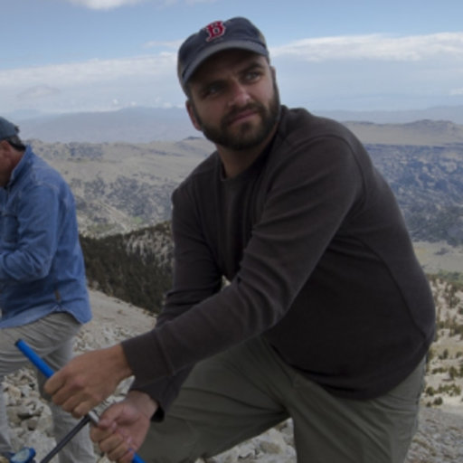

```{r setup, include=FALSE}
knitr::opts_chunk$set(echo = FALSE)
```

## Lead Author: Andy Bunn  {.flexbox .vcenter}


## Andy Bunn

* Associate Professor, Dept. of Environmental Science, Western Washington University
* PhD Environmental Sciences, Montana State University

   * dendrochronology
   * remote sensing
   * carbon balance


## dplR: Dendrochronology Program Library in R

The functions of this package perform standard tree-ring analyses such as building a mean value chronology, detrending, and crossdating.

 *Main functions:

    *read.rwl reads rwl files
    *detrend detrends raw ring widths
    *chron builds chronologies
    *corr.rwl.seg crossdating function
    
## Crossdating Code

```{r demo, echo=TRUE, results='hide', message=FALSE, warning = FALSE, fig.keep='none'}
library(utils)
library(dplR)

data(ca533)
Cross_SEGS <- corr.rwl.seg(ca533, seg.length = 50, pcrit = 0.10)
```

## Crossdating Output

```{r, echo=FALSE,results='hide', fig.keep='all', message = FALSE, warning = FALSE}
data(ca533)
Cross_SEGS <- corr.rwl.seg(ca533, seg.length = 50, pcrit = 0.10)
```

## Detrending Code
```{r demo2, echo=TRUE, results='hide', message=FALSE, warning = FALSE, fig.keep='none'}
library(utils)
library(dplR)

data(ca533)
series <- ca533[, "CAM011"]
names(series) <- rownames(ca533)
#makes plot with three methods
series.rwi <- detrend.series(y = series, y.name = "CAM011",
method=c("Spline", "ModNegExp","Friedman"),
difference=TRUE)
```

## Detrending Output

```{r, echo=FALSE,results='hide', fig.keep='all', message = FALSE, warning = FALSE}
data(ca533)
series <- ca533[, "CAM011"]
names(series) <- rownames(ca533)

series.rwi <- detrend.series(y = series, y.name = "CAM011",
method=c("Spline", "ModNegExp","Friedman"),
difference=TRUE)
```

## References

<https://cran.r-project.org/web/packages/dplR/dplR.pdf>

<https://huxley.wwu.edu/people/bunna>